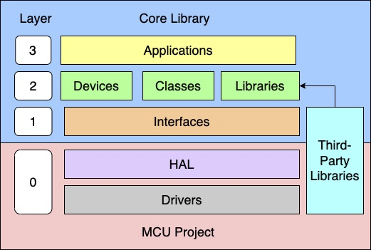

# Embedded C Development Framework

Development Framework For Embedded C Firmware Projects

# Framework Hierarchy

The proposed embedded C Firmware development framework, is separated into two main regions, MCU Project is responsible for all Hardware-specific implementations, while Core Library (blue region) contains all systems implementations in a generic form. The main idea of this structure is to provide complete separation between hardware and system, allowing the reuse of Core Library in virtually any other MCU that supports the required features required by its specifications.

Besides portability, the framework provides organizational procedures to improve how firmware code is maintained. 

Embedded projects are, usually, implemented according to how a certain MCU and its peripherals work, which may introduce a great number of problems regarding portability and reuse aspects. Many embedded applications are conceived in the edge of available MCU resources, making this strategy the most efficient for that matter. However, a considerable slice of modern embedded projects to not exist in those limits, allowing their implementations to spent a little more resources in favor of other benefits.

MCU Project provides a region where all MCU-specific implementations can be freely developed without interacting with any system code. Besides that, developers will be oriented to implement standardize functions, provided by Core Library, that will act as a medium between the two framework regions.

The Core Library region was designed to be fully Hardware decoupled and portable to any MCU in the specification domain. Also, this allows Core Library to be run by the developers computer or continuous development applications, without any Hardware. As a result, the development time gets reduced since time consuming processes can be avoided. Also, Firmware developers are able to use sophisticated tools that could only be used by software developers. Finally, the whole system can be tested through unit testing without any Hardware emulation.

## Framework Elements Naming Conventions

### **Modules**
Every framework layer element is called a **module**. A layer is composed of multiple modules.

### **Components**
Components are layer 2 modules. They are designed to allow code modularization and reuse. The main propose of components is to separate and specialize code implementation into small components that can be easily understood. Components are separated into two types:

- **External Components:** are implementations that can be reused by multiple projects. They can be seen as independent modules that can be imported to the project. These components must be self contained and independent of other project specific components.
- **Project Components:** are specific for the Firmware under development. They are not required to be reusable and may depend on other components. This flexibility is intended to reduce the development overhead for elements that should only exist for a single project. At the same time, these components should still be designed as a modular parts of the system. As a result, these components create an abstraction level between generic and system specific behaviors. Finally, Project Components are the only components that can, directly, import interfaces from layer 1.
Besides types, components are separated into three categories (Classes, Devices and Libraries). Each category is responsible for different type of modularization and have different design paths.

## Layer Documentations

- [Drivers and HALs](modules/layer%200/doc_layer_0.md)
- [Interfaces](modules/layer%201/doc_layer_1.md)
- [Devices](modules/layer%202/devices/doc_layer_2_devices.md)
- [Classes](modules/layer%202/classes/doc_layer_2_classes.md)
- [Libraries](modules/layer%202/libraries/doc_layer_2_libraries.md)
- [Application](modules/layer%203/doc_layer_3.md)

# MCU Project Specifications

The framework’s MCU Project region was designed to support different MCUs. Developers may replace the current MCU Project repository by a different version created for another target MCU. To allow that, the system architect should define the required domain where his Core Library should exist. This should provide all information regarding the portability domain foreseen by this architect. 
Common domain specifications are: 

- MCU Specifications
  - Bit depth (8-bits, 32-bits, etc.)
  - Architecture (ARM, RISC-V, AVR, PIC, etc.)
  - Endianness 
  - Minimal memory size
  - Minimal operating frequency
  - Required peripherals
- Bare-Metal or RTOS
- Third-Party library support
- Compiler
- Peripheral configurations
- Driver design path (blocking, IRQ, DMA, etc.)

These requirements are, however, not limited to this list, required or must coexist in every project. Instead, the system architect can define its domain as it sees fit. In this process, the architect may fell into trying to reduce the development complexity by restricting domain too much, or defining a wide portable domain that may result in the substantial increase of development complexity. Therefore, one must find a balance between those two edges, to provide a reasonable domain for the reality of the product under development.

# Novice Framework Choices (NFC)

Novice developers are often included into projects with few (or even none) supervision of other experienced developers. As a result, these developers may introduce problems to the system or violate the design choices made by the system architect. To address that, the framework ensures the standardization and accuracy for the development process. Also, it provides conventions called [Novice Framework Choices](doc_novice_choices.md), that, solely, aims to guide these developers and prevent their most common mistakes.

# Framework Conventions

Another common mistake that many Firmware projects present is the lack of development conventions. They, however, have a key importance in well organized environment and allowing the easy comprehension of the developed system. For that reason, the framework establishes a few conventions. Along with that, it is advised that the system architect defines his own conventions.

## Module Prefixes
The framework recommends the following prefix convention:

|    Module    | Prefix |
| :----------: | :----: |
|  Interfaces  |  mid   |
|   Devices    |  dev   |
|   Classes    |  cls   |
|  Libraries   |  lib   |
| Applications |  app   |

Other modules not listed in this table are not required to have prefixes. The prefixes should be used in module files and every public functions. Also, the framework advises their use by other code elements (`typedef`s and macros for example). The use of prefixes allows that developers easily locate and understand dependencies of the code they are working on, while also providing a better project organization.

## Module Files
The framework defines that the modules can only be imported by their respective public headers. This allows developers to safely implement the their modules without an extensive documentation overhead of what should or not be used outside a module. Besides that, each module type provides a set of standard files to provide a better module organization. This was made as a NFC to allow developers to get use to Object-Oriented access modifiers. Finally, the public "types" header was added as another NFC as a simple solution to major recursive inclusion problems. With it, `typedef`s are separated from prototype functions, allowing modules to share types without dealing with conflicts.

The framework defines the following access modifiers functions:

| Modifier |                       Description                        |
| :------: | :------------------------------------------------------: |
|  Public  |             Can be accessed by other modules             |
| Private  |  Should be only accessed by the module main source file  |
| Internal | Can be accessed by other source files of the same module |

## Documentation
Every module must contain a documentation file. Since supported by most version control systems, the framework recommends the use of Markdown `README.md` files. Developers should provide essential information regarding module specifications, design choices, how-to-use tutorial, examples, reference links and files, state-flow diagrams and any other relevant information. Architects should also define an in-code documentation standard.

## Development Guidelines

Architects should provide guidelines for a standard project development. As a suggestion, the Framework provides the following [Development Standard](doc_development_standard.md).

# References: 

---
**Disclosure**

This framework includes the experience of an extensive number of reference works. In this section, we will list only the most important references that may be used as an appendix for going deeper into this framework.

---

- [QuantumLeaps Object-Oriented C Framework](https://github.com/QuantumLeaps/OOP-in-C)
- [Barr Group Embedded C Coding Standard](https://barrgroup.com/embedded-systems/books/embedded-c-coding-standard)
